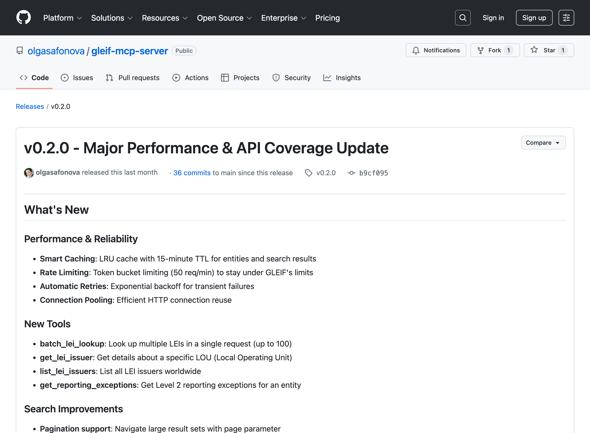

# Connect Claude Desktop to GLEIF (Company Lookup)

This guide helps you give Claude Desktop the ability to look up company information from the official global business registry. No coding required.

**Time needed:** 5-10 minutes
**Skill level:** Beginner (if you can copy-paste, you can do this)

---

## What You'll Get

After setup, you can ask Claude things like:
- "Look up Apple's LEI"
- "Find the parent company of this subsidiary"
- "Verify if this company registration is valid"

Claude will search the official GLEIF database and return verified company data.

---

## Before You Start

You need:
- [ ] Claude Desktop installed ([download here](https://claude.ai/download))
- [ ] A Mac or Windows computer
- [ ] 10 minutes of uninterrupted time

---

## Step 1: Download the GLEIF Tool

1. Go to the **[v0.2.0 release page](https://github.com/olgasafonova/gleif-mcp-server/releases/tag/v0.2.0)**

2. Scroll down to the **Assets** section

3. Download the file for your computer:

   | Your Computer | Download This File |
   |---------------|-------------------|
   | Mac with M1/M2/M3/M4 chip | `gleif-mcp-server-darwin-arm64` |
   | Mac with Intel chip | `gleif-mcp-server-darwin-amd64` |
   | Windows | `gleif-mcp-server-windows-amd64.exe` |

   > **Not sure which Mac you have?** Click the Apple menu () → "About This Mac". If it says "Apple M1" or similar, you have Apple Silicon. If it says "Intel", you have Intel.

4. The file will download to your **Downloads** folder



---

## Step 2: Allow the File to Run (Mac Only)

macOS blocks files downloaded from the internet. You need to unblock it.

1. Open **Terminal** (press `Cmd + Space`, type "Terminal", press Enter)

2. Copy and paste this entire command, then press Enter:

   ```
   chmod +x ~/Downloads/gleif-mcp-server-darwin-arm64 && xattr -d com.apple.quarantine ~/Downloads/gleif-mcp-server-darwin-arm64
   ```

   > **Using Intel Mac?** Replace `darwin-arm64` with `darwin-amd64` in the command above.

3. You won't see any message if it worked. That's normal.

4. Close Terminal

<!-- TODO: Terminal with command entered -->

**Windows users:** Skip this step. Windows doesn't block the file.

---

## Step 3: Find Your Username

You'll need your computer username for the next step.

### On Mac:
1. Open **Terminal** (press `Cmd + Space`, type "Terminal", press Enter)
2. Type `whoami` and press Enter
3. Write down what it shows (e.g., `olga` or `john`)

### On Windows:
1. Open **File Explorer**
2. Go to `C:\Users\`
3. Your username is the folder name you normally use (e.g., `Olga` or `John`)

<!-- TODO: Terminal showing whoami result -->

---

## Step 4: Open the Claude Config File

### On Mac:

1. Open **Finder**

2. Press `Cmd + Shift + G` (this opens "Go to Folder")

3. Paste this path and press Enter:
   ```
   ~/Library/Application Support/Claude/
   ```

4. You should see a folder open. Look for a file called `claude_desktop_config.json`

   - **If the file exists:** Double-click to open it (it will open in TextEdit)
   - **If the file doesn't exist:** Right-click in the folder → New Document → name it `claude_desktop_config.json`

<!-- TODO: Finder Go to Folder dialog -->
<!-- TODO: Claude folder with config file -->

### On Windows:

1. Press `Win + R` (this opens "Run")

2. Paste this path and press Enter:
   ```
   %APPDATA%\Claude
   ```

3. Look for `claude_desktop_config.json`

   - **If the file exists:** Right-click → Open with → Notepad
   - **If the file doesn't exist:** Right-click in folder → New → Text Document → name it `claude_desktop_config.json`

---

## Step 5: Add the GLEIF Configuration

Now you'll tell Claude Desktop where to find the GLEIF tool.

### If the config file is empty or new:

**Mac users** - Copy this entire block and paste it into the file:

```json
{
  "mcpServers": {
    "gleif": {
      "command": "/Users/YOUR_USERNAME/Downloads/gleif-mcp-server-darwin-arm64"
    }
  }
}
```

**Windows users** - Copy this entire block instead:

```json
{
  "mcpServers": {
    "gleif": {
      "command": "C:\\Users\\YOUR_USERNAME\\Downloads\\gleif-mcp-server-windows-amd64.exe"
    }
  }
}
```

**Important:** Replace `YOUR_USERNAME` with the username you found in Step 3.

### If the config file already has content:

You need to add GLEIF to the existing `mcpServers` section. Here's an example of what it might look like with multiple servers:

```json
{
  "mcpServers": {
    "existing-server": {
      "command": "/some/path/to/existing-server"
    },
    "gleif": {
      "command": "/Users/YOUR_USERNAME/Downloads/gleif-mcp-server-darwin-arm64"
    }
  }
}
```

Notice the comma after the closing `}` of the existing server.

<!-- TODO: TextEdit with config file filled in -->

---

## Step 6: Save and Restart Claude

1. **Save the config file**
   - Mac: `Cmd + S`
   - Windows: `Ctrl + S`

2. **Quit Claude Desktop completely**
   - Mac: Click Claude in menu bar → Quit Claude, or press `Cmd + Q`
   - Windows: Right-click Claude in system tray → Exit

3. **Open Claude Desktop again**

---

## Step 7: Verify It Works

1. In Claude Desktop, start a new conversation

2. Look for a small hammer/tools icon (🔨) near the text input. This means tools are available.

3. Type this message:
   ```
   Look up Apple's LEI using GLEIF
   ```

4. Claude should call the GLEIF tool and return something like:

   > **Apple Inc.**
   > - LEI: HWUPKR0MPOU8FGXBT394
   > - Country: United States
   > - Status: Active

<!-- TODO: Claude Desktop showing successful GLEIF response -->

---

## Troubleshooting

### "I don't see the tools icon"

- Make sure you saved the config file
- Make sure you completely quit and reopened Claude Desktop (not just closed the window)
- Check that the file is named exactly `claude_desktop_config.json` (not `.json.txt`)

### "Claude says it can't find the tool"

The path in your config file is probably wrong. Double-check:
- Your username is spelled correctly
- The file is actually in your Downloads folder
- You downloaded the right version for your computer (Mac ARM vs Intel vs Windows)

### "Permission denied" or "can't execute"

**Mac:** Run the Terminal command from Step 2 again.

**Windows:** Right-click the .exe file → Properties → check "Unblock" at the bottom → Apply.

### "Invalid JSON" error

Your config file has a syntax error. Common issues:
- Missing comma between servers
- Missing quotation marks around paths
- Extra comma after the last item

Use [JSONLint](https://jsonlint.com/) to check your config.

### Still stuck?

1. Open the config file and copy its contents
2. Start a new Claude conversation and paste: "Can you check if this MCP config looks correct?" followed by your config
3. Claude can often spot the issue

---

## What Can You Do Now?

Try these prompts:

| What You Want | Ask Claude |
|---------------|------------|
| Look up a company | "Find the LEI for Microsoft" |
| Verify a company ID | "Is LEI 5493006MHB84DD0ZWV18 valid?" |
| Find parent company | "Who owns this subsidiary? LEI: 549300GKFG0RYRRQ1414" |
| Search by country | "List technology companies in Germany with LEIs" |
| Find by bank code | "What company has BIC code DEUTDEFF?" |

---

## Next Steps

Want to add more capabilities to Claude Desktop? Check out:
- [MCP Server Directory](https://github.com/modelcontextprotocol/servers) - Official list of available tools
- [Awesome MCP Servers](https://github.com/punkpeye/awesome-mcp-servers) - Community curated list

---

## Need Help?

- **GLEIF issues:** [Open an issue](https://github.com/olgasafonova/gleif-mcp-server/issues)
- **Claude Desktop issues:** [Anthropic Support](https://support.anthropic.com/)
